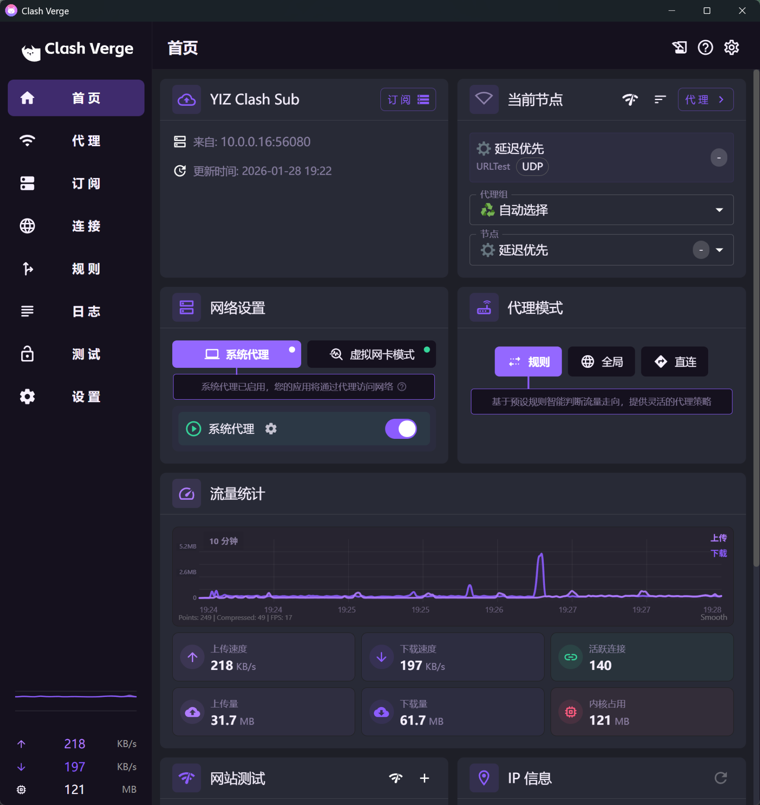
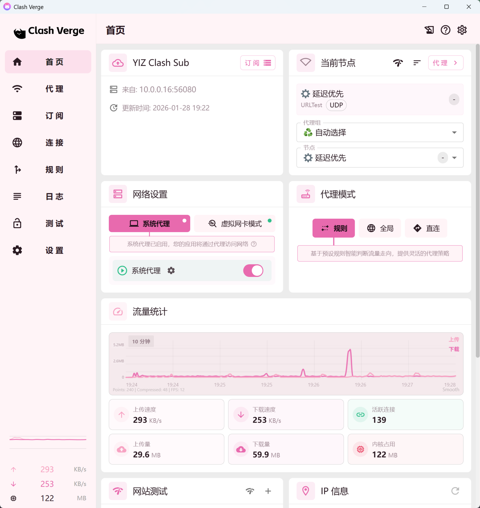

<h1 align="center">
  
  <br>
  YIZ Edition of <a href="https://github.com/clash-verge-rev/clash-verge-rev/">Clash Verge Rev</a>
  <br>
</h1>

<h3 align="center">
A Clash Meta GUI based on <a href="https://github.com/tauri-apps/tauri">Tauri</a>.
</h3>

<p align="center">
  Languages:
  <a href="./README.md">简体中文</a> ·
  <a href="./docs/README_en.md">English</a> ·
  <a href="./docs/README_es.md">Español</a> ·
  <a href="./docs/README_ru.md">Русский</a> ·
  <a href="./docs/README_ja.md">日本語</a> ·
  <a href="./docs/README_ko.md">한국어</a> ·
  <a href="./docs/README_fa.md">فارسی</a>
</p>

## Preview

| Dark                             | Light                             |
| -------------------------------- | --------------------------------- |
|  |  |

## YIZ Edition

### YIZ Features

- 默认开启选项：TUN 模式、系统代理模式、开机自启、外部控制器；
- 订阅：包含内置的YIZ默认订阅；
- 全局扩展：包含硬编码的全局扩展脚本和全局扩展覆写配置；
- 更新：使用YIZ内部的[更新代理服务](https://github.com/YIZTDs/YizUpdateServer)进行应用更新检查以及默认订阅更新；
- UI：切换新的应用图标；更新UI主题风格；隐藏非必要的选项至管理员模式(设置页面通过`Ctrl+Shift+Y`进入)；
- 注册表：注册表添加 YIZ 相关变量，方便识别 YIZ 版本的 Clash Verge Rev；

### YIZ Dev Tips

- YIZ Edition 启动时会强制写入全局 Merge/Script 与默认订阅参数。 要修改内置内容，请编辑以下文件：
  - `yiz/builtin/yiz_global_merge.yaml`
  - `yiz/builtin/yiz_global_script.js`
  - `yiz/builtin/yiz_default_profile.yaml`
- 使用 YIZ 版本特定的的签名密钥进行签名，参见: [yiz tauri 目录](./yiz/.tauri/)。
- 更新订阅和应用依赖于：[YizUpdateServer](https://github.com/YIZTDs/YizUpdateServer)
  - 编辑订阅链接：http://10.0.0.16:56080/admin
- YIZ Edition frontend gates use the compile-time flag `VITE_YIZ_EDITION`. `dev:yiz` / `build:yiz` and related scripts inject this flag automatically.

## Install

请到发布页面下载对应的安装包：[Release page](https://github.com/clash-verge-rev/clash-verge-rev/releases)<br>
Go to the [Release page](https://github.com/clash-verge-rev/clash-verge-rev/releases) to download the corresponding installation package<br>
Supports Windows (x64/x86), Linux (x64/arm64) and macOS 10.15+ (intel/apple).

#### 安装说明和常见问题，请到 [文档页](https://clash-verge-rev.github.io/) 查看

---

## Features

- 基于性能强劲的 Rust 和 Tauri 2 框架
- 内置[Clash.Meta(mihomo)](https://github.com/MetaCubeX/mihomo)内核，并支持切换 `Alpha` 版本内核。
- 简洁美观的用户界面，支持自定义主题颜色、代理组/托盘图标以及 `CSS Injection`。
- 配置文件管理和增强（Merge 和 Script），配置文件语法提示。
- 系统代理和守卫、`TUN(虚拟网卡)` 模式。
- 可视化节点和规则编辑
- WebDav 配置备份和同步

### FAQ

Refer to [Doc FAQ Page](https://clash-verge-rev.github.io/faq/windows.html)

## Development

See [CONTRIBUTING.md](./CONTRIBUTING.md) for more details.

To run the development server, execute the following commands after all prerequisites for **Tauri** are installed:

```shell
pnpm i
pnpm run prebuild
pnpm dev
```

## Acknowledgement

Clash Verge rev was based on or inspired by these projects and so on:

- [zzzgydi/clash-verge](https://github.com/zzzgydi/clash-verge): A Clash GUI based on tauri. Supports Windows, macOS and Linux.
- [tauri-apps/tauri](https://github.com/tauri-apps/tauri): Build smaller, faster, and more secure desktop applications with a web frontend.
- [Dreamacro/clash](https://github.com/Dreamacro/clash): A rule-based tunnel in Go.
- [MetaCubeX/mihomo](https://github.com/MetaCubeX/mihomo): A rule-based tunnel in Go.
- [Fndroid/clash_for_windows_pkg](https://github.com/Fndroid/clash_for_windows_pkg): A Windows/macOS GUI based on Clash.
- [vitejs/vite](https://github.com/vitejs/vite): Next generation frontend tooling. It's fast!

## License

GPL-3.0 License. See [License here](./LICENSE) for details.
